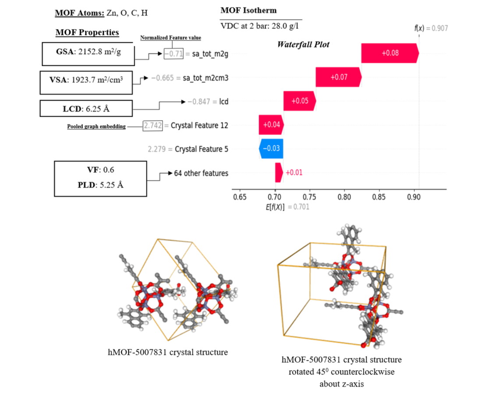
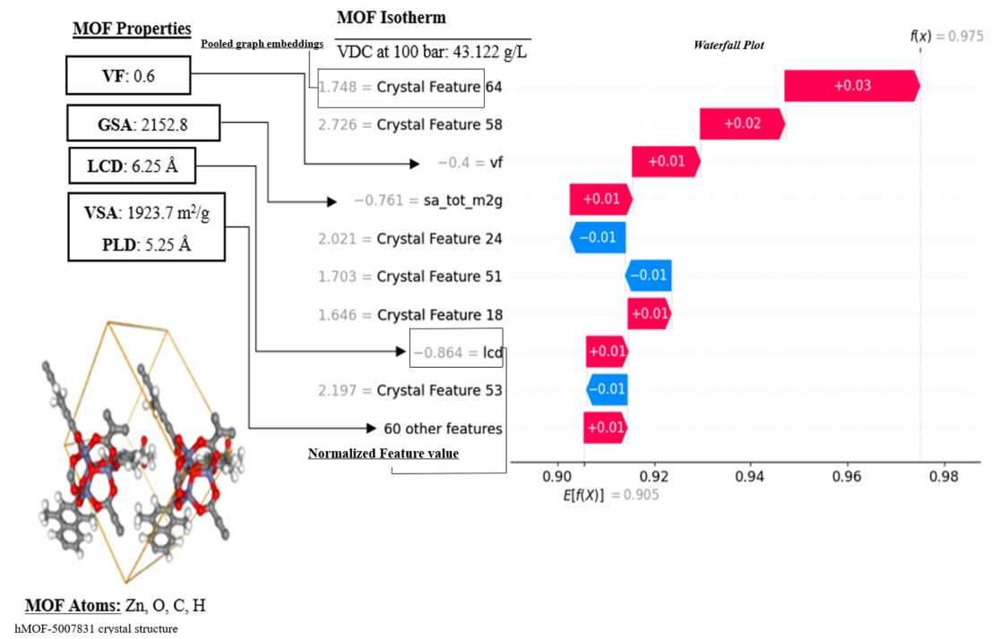
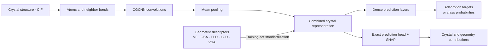

# AG-CGCNN

### Mechanistic insights from crystal structure to gas adsorption

[](https://doi.org/10.1021/acs.iecr.4c03301)
[](LICENSE)
[](docs/PROVENANCE.md)

**AG-CGCNN combines learned crystal representations with geometric descriptors to predict and explain adsorption in metal–organic frameworks (MOFs).** This repository accompanies *Incorporating Mechanistic Insights into Structure–Property Modeling of Metal–Organic Frameworks for H₂ and CH₄ Adsorption: A CGCNN Approach* (2025).

The model builds on [Tian Xie and Jeffrey C. Grossman's CGCNN](https://github.com/txie-93/cgcnn). It retains the crystal graph convolution and pooling approach, appends geometric descriptors, and exposes the resulting representation for SHAP analysis.

## A closer look at the explanations

| H₂ at 2 bar | H₂ at 100 bar |
|:---:|:---:|
|  |  |

The same MOF, **hMOF-5007831**, has different feature contributions at different pressures. The plots combine crystal-feature and geometric-feature attributions with structure illustrations. Cropped from Figure 7 of [Asiedu et al. (2025)](https://doi.org/10.1021/acs.iecr.4c03301), **CC BY 4.0**. Only the figure panels are reproduced; journal headings, surrounding text and printed captions are excluded. [Figure provenance](docs/figures/README.md).

## How it works



SHAP explains the model relative to a selected background population. Its attributions support interpretation; they do not independently prove a physical causal mechanism.

## Start here

**Python 3.11 or newer** is required. A GPU is optional.

```bash
git clone https://github.com/kkasiedu1914/AG-CGCNN.git
cd AG-CGCNN
python -m venv .venv
# Linux/macOS: source .venv/bin/activate
# Windows PowerShell: .venv\Scripts\Activate.ps1
python -m pip install --upgrade pip "setuptools>=83" wheel
python -m pip install -e ".[notebooks,explain,test]"
```

Try the small **synthetic software demonstration**:

```bash
python scripts/make_demo_data.py --output examples/demo
python -m agcgcnn.train --data examples/demo --epochs 2 --batch-size 8 --atom-fea-len 8 --hidden 12 --convolutions 1 --output runs/demo
python -m agcgcnn.predict --checkpoint runs/demo/best.pt --data examples/demo --output runs/demo-predictions
python -m pytest -q
```

The demo checks the pipeline. Its artificial structures and targets are **not paper data or adsorption results**.

### Guided notebooks

1. [Training and prediction](notebooks/01_training_and_prediction.ipynb): prepare inputs, train, inspect learning history, and export predictions.
2. [SHAP explainability](notebooks/02_shap_explainability.ipynb): select a background, verify prediction-head equivalence, and produce a waterfall explanation.

Launch them with `jupyter lab`. Run notebook 01 before notebook 02. Use a new run name when repeating the demo to preserve earlier outputs.

## Repository guide

| Location | Purpose |
|---|---|
| `cgcnn/model.py` | Original AG-CGCNN architecture, with CGCNN attribution |
| `agcgcnn/` | Validated data loading, training, prediction, safe checkpoints and SHAP |
| `notebooks/` | Documented, runnable training and explanation walkthroughs |
| `scripts/` | Synthetic demonstration generator |
| `tests/` | Functional, numerical and input-safety tests |
| `docs/` | Usage, data schema, provenance, security and validation |
| `archive/research/` | Read-only source snapshots of research scripts and Colab notebooks |

**[Usage guide](docs/USAGE.md) · [Data format](docs/DATA.md) · [Provenance and changes](docs/PROVENANCE.md) · [Validation](docs/VALIDATION.md) · [Security](SECURITY.md)**

## Research status and reproducibility

This is a research release; **active development is currently paused**. The maintained entry points provide a cleaned and tested implementation of the recovered architecture. Historical experiments are retained as reference snapshots, with notebook outputs cleared and obsolete upload helpers excluded.

Full MOF databases, original serialized experiment objects and trained research checkpoints are not bundled in the Git repository. The data guide describes the required inputs and original sources. Reproducing the paper's numbers requires matching the original datasets, labels, splits, hyperparameters and checkpoints; the release smoke tests do not establish numerical reproduction of the paper.

## Credit and citation

Please cite both the AG-CGCNN paper and the foundational CGCNN paper when using this work. The original CGCNN implementation is **Copyright (c) 2018 Tian Xie**, licensed under MIT; the notice is retained in [LICENSE](LICENSE). See [NOTICE.md](NOTICE.md) for component attribution and the distinction between code and figure licenses.

```bibtex
@article{asiedu2025agcgcnn,
  title = {Incorporating Mechanistic Insights into Structure--Property Modeling of Metal--Organic Frameworks for H2 and CH4 Adsorption: A CGCNN Approach},
  author = {Asiedu, Kwabena Koranteng and Achenie, Luke E. K. and Asamoah, Tracy and Arthur, Emmanuel Kwesi and Asiedu, Nana Yaw},
  journal = {Industrial & Engineering Chemistry Research},
  year = {2025}, volume = {64}, number = {7}, pages = {3764--3784},
  doi = {10.1021/acs.iecr.4c03301}
}

@article{xie2018cgcnn,
  title = {Crystal Graph Convolutional Neural Networks for an Accurate and Interpretable Prediction of Material Properties},
  author = {Xie, Tian and Grossman, Jeffrey C.},
  journal = {Physical Review Letters}, year = {2018}, volume = {120},
  pages = {145301}, doi = {10.1103/PhysRevLett.120.145301}
}
```
